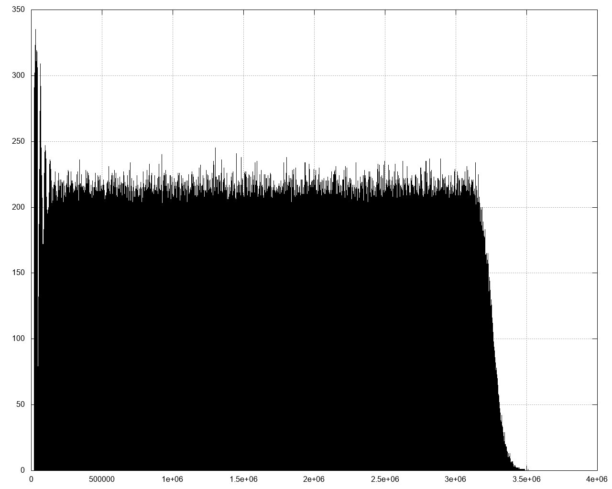
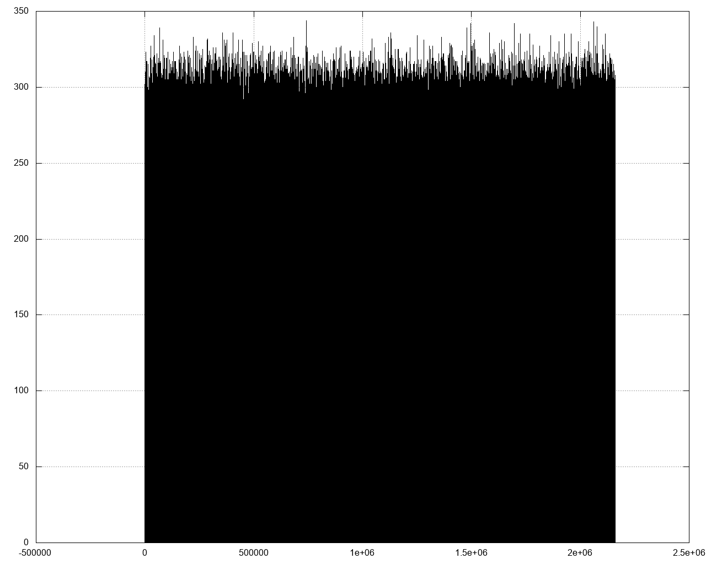

# Periodic Queue Driver Bundle

A driver for [Queue Manager Bundle](https://github.com/mcfedr/queue-manager-bundle) that uses runs jobs periodically.

This driver doesn't run jobs, it requires another driver to actually process jobs.

## Usage

There is no runner daemon for this driver as it just plugs into other drivers. Use it by
`put`ting jobs into this driver with the `period` option.

## Install

### Composer

    composer require mcfedr/periodic-queue-driver-bundle

### AppKernel

Include the bundle in your AppKernel

    public function registerBundles()
    {
        $bundles = [
            ...
            new Mcfedr\QueueManagerBundle\McfedrQueueManagerBundle(),
            new Mcfedr\PeriodicQueueDriverBundle\McfedrPeriodicQueueDriverBundle(),

## Config

With this bundle installed you can setup your queue manager config similar to this:

    mcfedr_queue_manager:
        managers:
            periodic:
                driver: periodic
                options:
                    default_manager: delay
                    default_manager_options: []

This will create a `QueueManager` service named `"mcfedr_queue_manager.periodic"`

* `default_manager` - Default job processor, must support delayed jobs, for example [Doctrine Delay](https://packagist.org/packages/mcfedr/doctrine-delay-queue-driver-bundle)
* `default_manager_options` - Default options to pass to job processor `put`

## Options to `QueueManager::put`

* `period` - The average number of seconds between job runs
* `manager` - Use a different job processor for this job
* `manager_options` - Options to pass to the processors `put` method

## Explanation

### Commands

There are two commands that can be used to investigate how well spread jobs will. A simple way to visualize is to
pipe into [feedgnuplot](https://github.com/dkogan/feedgnuplot).

`rand-add` uses a naive implementation of just adding a random number of seconds to get the time for the next run:

    ./tests/console test:distribution:rand-add -v | feedgnuplot --histogram 0 --binwidth 60 --hardcopy "rand-add.png" --exit
    

`periodic` uses the bundle implementation:

    ./tests/console test:distribution:periodic -v | feedgnuplot --histogram 0 --binwidth 60 --hardcopy "periodic.png" --exit

